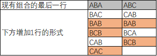

# LeetCode第184场竞赛

### [5380. 数组中的字符串匹配](https://leetcode-cn.com/contest/weekly-contest-184/problems/string-matching-in-an-array/)

给你一个字符串数组 `words` ，数组中的每个字符串都可以看作是一个单词。请你按 **任意** 顺序返回 `words` 中是其他单词的子字符串的所有单词。

如果你可以删除 `words[j]` 最左侧和/或最右侧的若干字符得到 `word[i]` ，那么字符串 `words[i]` 就是 `words[j]` 的一个子字符串。

**提示：**

- `1 <= words.length <= 100`
- `1 <= words[i].length <= 30`
- `words[i]` 仅包含小写英文字母。
- 题目数据 **保证** 每个 `words[i]` 都是独一无二的。

### 思路

第一道题, 直接暴力解决.

### 代码

```python
class Solution:
    def stringMatching(self, words: List[str]) -> List[str]:
        res = []
        for i in range(len(words)):
            for j in range(len(words)):
                if i == j: continue
                if words[i] in words[j]:
                    res += [words[i]]
                    break
        return res
```

### 复杂度分析

时间复杂度:`O(n^2)`; 空间复杂化: `O(1)`

### 5381. 查询带键的排列

给你一个待查数组 `queries` ，数组中的元素为 `1` 到 `m` 之间的正整数。 请你根据以下规则处理所有待查项 `queries[i]`（从 `i=0` 到 `i=queries.length-1`）：

- 一开始，排列 `P=[1,2,3,...,m]`。
- 对于当前的 `i` ，请你找出待查项 `queries[i]` 在排列 `P` 中的位置（**下标从 0 开始**），然后将其从原位置移动到排列 `P` 的起始位置（即下标为 0 处）。注意， `queries[i]` 在 `P` 中的位置就是 `queries[i]` 的查询结果。

请你以数组形式返回待查数组 `queries` 的查询结果。

**提示：**

- `1 <= m <= 10^3`
- `1 <= queries.length <= m`
- `1 <= queries[i] <= m`

### 思路

使用数组保存对应数字所在位置. 例如`memo[5] = 4`, 表示`5`目前的位置为`4`, 当查询发生时, 在对应下标之前, 位置加`1`即可

### 代码
```python
class Solution:
    def processQueries(self, queries: List[int], m: int) -> List[int]:
        memo = [i - 1 for i in range(1 + m)] 
        res = []
        for i in queries:
            res += [memo[i]]
            for j, v in enumerate(memo):
                if v < memo[i]:
                    memo[j] = v + 1
            memo[i] = 0
        return res
```

### 复杂度分析
时间复杂度:`O(n^2)`; 空间复杂化: `O(n)`

### [5382. HTML 实体解析器](https://leetcode-cn.com/contest/weekly-contest-184/problems/html-entity-parser/)

「HTML 实体解析器」 是一种特殊的解析器，它将 HTML 代码作为输入，并用字符本身替换掉所有这些特殊的字符实体。

HTML 里这些特殊字符和它们对应的字符实体包括：

- **双引号：**字符实体为 `"` ，对应的字符是 `"` 。
- **单引号：**字符实体为 `'` ，对应的字符是 `'` 。
- **与符号：**字符实体为 `&` ，对应对的字符是 `&` 。
- **大于号：**字符实体为 `>` ，对应的字符是 `>` 。
- **小于号：**字符实体为 `<` ，对应的字符是 `<` 。
- **斜线号：**字符实体为 `⁄` ，对应的字符是 `/` 。

给你输入字符串 `text` ，请你实现一个 HTML 实体解析器，返回解析器解析后的结果。

**提示：**

- `1 <= text.length <= 10^5`
- 字符串可能包含 256 个ASCII 字符中的任意字符。

### 思路

直接使用字符串的`replace`函数即可

### 代码
```python
class Solution:
    def entityParser(self, text: str) -> str:
        memo = {r'&quot;': r'"', r'&apos;':'\'', r'&amp;':r'&', r'&gt;':'>', r'&lt;':'<', r'&frasl;': r'/'}
        for i, j in memo.items():
            text = text.replace(i, j)
        return text
```

### 复杂度分析

时间复杂度:`O(n)`, `n`为`a+b+c`; 空间复杂化: `O(1)`

### [5383. 给 N x 3 网格图涂色的方案数](https://leetcode-cn.com/contest/weekly-contest-184/problems/number-of-ways-to-paint-n-x-3-grid/)

你有一个 `n x 3` 的网格图 `grid` ，你需要用 **红，黄，绿** 三种颜色之一给每一个格子上色，且确保相邻格子颜色不同（也就是有相同水平边或者垂直边的格子颜色不同）。

给你网格图的行数 `n` 。

请你返回给 `grid` 涂色的方案数。由于答案可能会非常大，请你返回答案对 `10^9 + 7` 取余的结果。

**提示：**

- `n == grid.length`
- `grid[i].length == 3`
- `1 <= n <= 5000`

### 思路:

按行便利, 每一行一共`12`种状态, 就是当`n=1`的那`12`种状态, 使用`dp[i]`表示第`i`种状态的出现的次数, 每一种状态都可以从前一行的若干个状态状态而来.
$$
dp[l][i] = \sum_{j}^{T_i}dp[l-1][j]
$$
$T_i$表示状态`i`的可以被转换的状态, 可以通过暴力获得. 根据公式编码即可, 优化后, 空间复杂为`O(1)`, 时间复杂度为`O(n)`

# 下面介绍`O(log(n))`算法.

转换状态不使用集合表示, 而是使用矩阵表示.
$$

T\left[ i \right] \left[ j \right] =\begin{cases}
	0\\
	1\\
\end{cases}\begin{array}{c}
	\text{状态}j\text{不可转换}为\text{状态}i\\
	\text{状态}j\text{可以转换}为\text{状态}i\\
\end{array}
$$
每个状态出现的次数使用列向量进行表示. 记为 `S`, 且`s(1) = [1] * 12`, 通过第一种方法的分析, 可以得出:
$$
S(k+1) = T * S(k) 
$$


不断迭代, 可以得到:
$$
S(n)=T^{n-1}*S(1)
$$
下面就是使用求幂的方法在`log(n)`的时间内计算出`T^{n-1}`即可得到答案, 为了方便, 我使用`numpy`中的函数.

根据规律可以进一步改进, 将所有情况分为两种情况, 一种为`ABA`, 一种为`ABC`. 



[图片来源](https://leetcode-cn.com/problems/number-of-ways-to-paint-n-x-3-grid/solution/shu-xue-jie-jue-fei-chang-kuai-le-by-lindsaywong/), 根据图片可以清楚的得到转移矩阵`T`, 以及初始化`S`
$$

T =\left| \begin{matrix}
	3&		2\\
	2&		2\\
\end{matrix} \right|
$$

$$
S(1)=[[6], [6]]
$$


### 代码:

```python
import numpy as np
class Solution:
    def numOfWays(self, n: int) -> int:
        n = n - 1
        mod = (int)(10 ** 9 + 7)
        x = [[1, 2, 1], [1, 2, 3], [1, 3, 1], [1, 3, 2], [2, 1, 2], [2, 3, 2], [2, 1, 3], [2, 3, 1], [3, 1, 3], [3, 2, 3], [3, 1, 2], [3,2,1]]
        cnt = [[0] * 12 for _ in range(12)]
        for i in range(12): ## 计算转移矩阵
            for j in range(12):
                if all(ii != jj for ii, jj in zip(x[i], x[j])):
                    cnt[i][j] = 1 
        trans_matrix = np.array(cnt, dtype='int64') ## 将数组转为numpy数组, 必须设置数据类型, 否则会溢出, 使答案错误
        res_matrix = np.zeros(shape=(12, 12), dtype='int64') ## 结果数组
        res_matrix.flat[::13] = [1] * 12 # 初始为单位矩阵, 与求幂时初始为1, 原理相同
        while n > 0: # 求幂的方法
            if n % 2:
                res_matrix = np.dot(trans_matrix, res_matrix) # 相当于乘法
                res_matrix = np.mod(res_matrix, mod) ## 相当于取余
            n = n // 2
            trans_matrix = np.dot(trans_matrix, trans_matrix)
            trans_matrix = np.mod(trans_matrix, mod)
        return int(np.sum(res_matrix) % mod) # 相当于计算S(n)=T^{n-1}*S(1), 并求和
```
进一步优化后代码:

```python
import numpy as np
class Solution:
    def numOfWays(self, n: int) -> int:
        n = n - 1
        mod = int(10 ** 9 + 7)
        trans_matrix = np.array([[3, 2], [2, 2]], dtype='int64')
        res_matrix = np.array([[1, 0], [0, 1]], dtype='int64')
        while n > 0:
            if n % 2:
                res_matrix = np.dot(trans_matrix, res_matrix)
                res_matrix = np.mod(res_matrix, mod)
            n = n // 2
            trans_matrix = np.dot(trans_matrix, trans_matrix)
            trans_matrix = np.mod(trans_matrix, mod)
        return int((np.sum(res_matrix) * 6) % mod)
```


### 复杂度分析

时间复杂度:`O(log(n))`; 空间复杂化: `O(1)`
